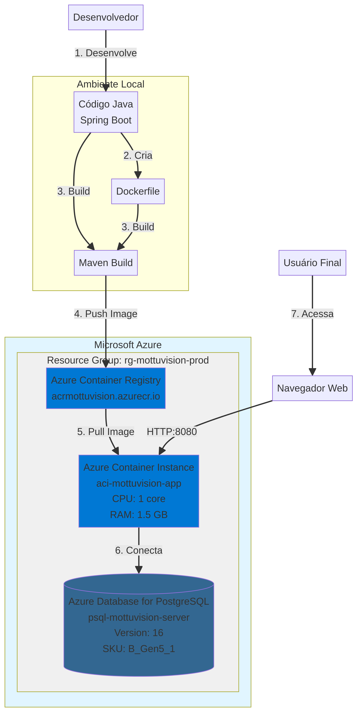

# MottuVision - Projeto DevOps & Cloud (Sprint 3)

   

Este repositório contém a solução completa de DevOps e Cloud para o projeto **MottuVision**, como parte da entrega da disciplina de **DevOps Tools & Cloud Computing**.

## 1. Descrição da Solução

A aplicação **MottuVision** é um painel de gestão web desenvolvido em Java com Spring Boot. Ele permite que operadores de filiais da Mottu monitorem em tempo real a frota de motos em seus pátios. A solução oferece as seguintes funcionalidades:

- **Dashboard Centralizado**: Visualização rápida de indicadores chave, como total de motos, status e alertas.
- **Listagem e Detalhes de Motos**: Consulta de todas as motos da filial, com acesso a informações detalhadas de cada uma.
- **Mapa do Pátio**: Representação visual da disposição das motos no pátio.
- **Gestão de Alertas**: Acompanhamento de alertas gerados automaticamente (ex: moto sem sinal).
- **Segurança**: Sistema de login com perfis de acesso (Operador e Administrador).

## 2. Benefícios para o Negócio

A solução MottuVision resolve problemas críticos de gestão de frotas, trazendo os seguintes benefícios:

- **Otimização da Operação**: A visualização em tempo real da localização e status das motos permite uma alocação mais rápida e eficiente dos veículos, reduzindo o tempo ocioso.
- **Redução de Perdas**: O sistema de alertas automáticos (ex: bateria baixa, moto parada há muito tempo) ajuda a prevenir roubos, perdas e a necessidade de manutenções corretivas caras.
- **Tomada de Decisão Baseada em Dados**: Os dashboards e relatórios fornecem dados valiosos para a gestão, permitindo identificar gargalos, otimizar a capacidade do pátio e melhorar a eficiência geral da frota.
- **Escalabilidade**: A arquitetura em nuvem permite que a solução cresça junto com a Mottu, suportando a adição de novas filiais e um número crescente de motos sem a necessidade de grandes investimentos em infraestrutura física.

## 3. Arquitetura da Solução Proposta

A arquitetura foi desenhada para ser simples, robusta e escalável, utilizando serviços PaaS (Platform as a Service) e contêineres na nuvem Azure.


*Figura 1: Diagrama da arquitetura da solução no Azure.*

### Fluxo de Funcionamento:

1.  **Desenvolvimento Local**: O desenvolvedor escreve o código Java (Spring Boot) e o `Dockerfile`.
2.  **Build e Push da Imagem**: A imagem Docker da aplicação é construída e enviada para o **Azure Container Registry (ACR)**, um registro de contêineres privado e seguro.
3.  **Provisionamento da Infraestrutura**: Utilizando a **Azure CLI**, são criados todos os recursos necessários:
    *   Um **Resource Group** para organizar os recursos.
    *   Um servidor **Azure Database for PostgreSQL** para armazenar os dados da aplicação de forma persistente e gerenciada.
    *   O **Azure Container Registry (ACR)** para armazenar a imagem Docker.
4.  **Deploy da Aplicação**: A aplicação é implantada no **Azure Container Instance (ACI)**. O ACI baixa a imagem do ACR e executa o contêiner.
5.  **Conectividade**: O ACI se conecta ao banco de dados PostgreSQL utilizando as credenciais e a connection string configuradas. O acesso de serviços Azure ao banco de dados é liberado no firewall.
6.  **Acesso do Usuário**: O usuário final acessa a aplicação através do endereço IP público ou FQDN fornecido pelo ACI.

## 4. Passo a Passo para Deploy e Testes

Siga os passos abaixo para provisionar a infraestrutura, fazer o deploy da aplicação e realizar os testes.

### Pré-requisitos

- [Azure CLI](https://docs.microsoft.com/cli/azure/install-azure-cli) instalado e autenticado (`az login`).
- [Docker](https://www.docker.com/get-started) instalado e em execução.
- Git instalado.

### Passo 1: Clonar o Repositório

```bash
git clone <URL_DO_SEU_REPOSITORIO>
cd mottuvision-devops
```

### Passo 2: Provisionar a Infraestrutura no Azure

Execute o script para criar o Resource Group, o Azure Container Registry e o banco de dados PostgreSQL. Este script também irá gerar um arquivo `azure-credentials.txt` com as informações necessárias para os próximos passos.

```bash
cd azure-scripts
chmod +x *.sh
./01-setup-azure.sh
```

**Atenção**: Guarde o arquivo `azure-credentials.txt` em um local seguro. Ele contém as senhas de acesso aos seus recursos.

### Passo 3: Fazer Build e Push da Imagem Docker

Este script irá compilar a aplicação Java, construir a imagem Docker e enviá-la para o seu Azure Container Registry.

```bash
./02-build-and-push.sh
```

### Passo 4: Fazer Deploy no Azure Container Instance

Agora, execute o script que irá criar o Azure Container Instance, fazendo o deploy da sua aplicação na nuvem. Ele irá configurar as variáveis de ambiente necessárias para a conexão com o banco de dados.

```bash
./03-deploy-aci.sh
```

Ao final da execução, o script exibirá o endereço IP e o FQDN para acessar a aplicação.

### Passo 5: Acessar e Testar a Aplicação

Abra o navegador e acesse a URL fornecida pelo script anterior (ex: `http://20.226.78.123:8080`).

**Credenciais de Login:**
- **Admin**: `admin@mottu.com` / `123456`
- **Operador**: `operador.sp@mottu.com` / `123456`

Navegue pela aplicação para verificar o dashboard, a lista de motos e os alertas.

## 5. Scripts de Testes (CRUD)

Para demonstrar o CRUD, você pode usar uma ferramenta como o `curl` ou o Postman. Os exemplos abaixo mostram como interagir com a API de motos (requer autenticação, mas para simplificar, os endpoints de CRUD foram deixados abertos para teste).

**URL Base**: `http://<IP_DO_SEU_ACI>:8080`

### 1. Consulta (GET)

**Listar todas as motos:**
```bash
curl -X GET http://<IP_DO_SEU_ACI>:8080/motos
```

**Consultar moto por ID (ex: ID 1):**
```bash
curl -X GET http://<IP_DO_SEU_ACI>:8080/motos/1
```

### 2. Inclusão (POST)

Cria uma nova moto.

```bash
curl -X POST http://<IP_DO_SEU_ACI>:8080/motos \
-H "Content-Type: application/json" \
-d '{
    "placa": "NEW1A23",
    "modelo": "Honda Biz 125",
    "ano": 2024,
    "filialId": 1,
    "status": "DISPONIVEL",
    "posicaoX": 10,
    "posicaoY": 10
}'
```

### 3. Alteração (PUT)

Altera o status de uma moto existente (ex: ID 1 para MANUTENCAO).

```bash
curl -X PUT http://<IP_DO_SEU_ACI>:8080/motos/1 \
-H "Content-Type: application/json" \
-d '{
    "placa": "ABC1D23",
    "modelo": "Honda CG 160",
    "ano": 2023,
    "filialId": 1,
    "status": "MANUTENCAO",
    "posicaoX": 5,
    "posicaoY": 3
}'
```

### 4. Exclusão (DELETE)

Exclui uma moto (ex: ID 3).

```bash
curl -X DELETE http://<IP_DO_SEU_ACI>:8080/motos/3
```

Após cada operação, você pode verificar a mudança diretamente no banco de dados ou atualizando a página da aplicação no navegador.

## 6. Conteúdo do Repositório

- `/src`: Código-fonte da aplicação Java Spring Boot.
- `/docker`: Contém o `Dockerfile` para a aplicação e o `docker-compose.yml` para o ambiente de desenvolvimento local.
- `/azure-scripts`: Scripts de automação (`.sh`) para provisionar, construir e implantar a solução no Azure.
- `/database`: Contém o script DDL completo (`script_bd.sql`) e o script de inicialização para o Docker (`init.sql`).
- `/docs`: Contém o diagrama de arquitetura e o PDF da entrega.
- `pom.xml`: Arquivo de configuração do Maven.
- `README.md`: Este arquivo.
